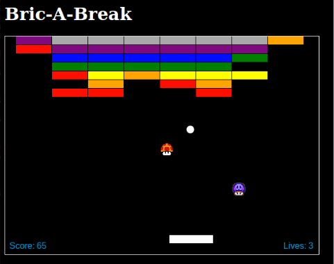

# Bric-A-Break [Live](https://victoracechen.github.io/Bric-A-Break/)

  Bric-A-Break is a browser game written in Javascript based off of Breakout.

Play it [here](https://victoracechen.github.io/Bric-A-Break/).



### How to Play

The player only needs to move the paddle.

You can move the paddle with the:<br />
Mouse or<br />
'A' for left and 'D' for right or<br />
'←' and '→' arrow keys

Prizes fall out of the blocks for special effects.

##### Collision detection
  Currently objects are interacting by the following method:
`````javascript
CollisionDetection.prototype.isOverlap = function(rect1, rect2) {
  return rect1.x < rect2.x + rect2.width &&
     rect1.x + rect1.width > rect2.x &&
     rect1.y < rect2.y + rect2.height &&
     rect1.height + rect1.y > rect2.y;
};
`````
  This is also applied to circular objects with the following adapter method:
`````javascript
Ball.prototype.toRect = function () {
  return {
    x: this.x - this.radius,
    y: this.y - this.radius,
    width: this.radius * 2,
    height: this.radius * 2
  };
};
`````
